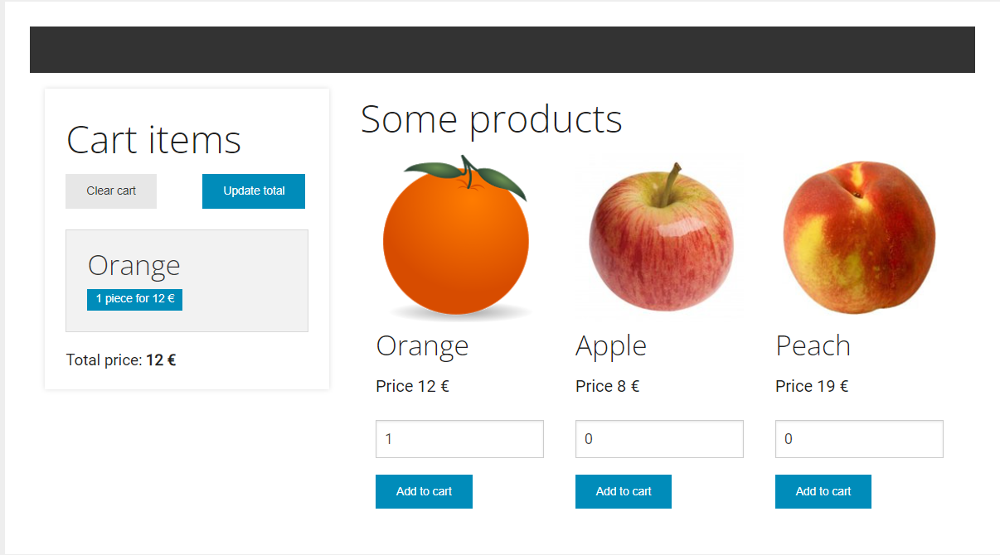

# DOOM/Events

En esta actividad se practican los diversos aspectos que ofrece el API DOM de JavaScript: búsqueda de nodos, iteración y manipulación de elementos, así como la gestión de eventos como respuesta a la interacción del usuario.

## Competencias 

En esta actividad se desarrollan las siguientes competencias:

* Que los estudiantes posean las habilidades de aprendizaje que les permitan continuar estudiando de una manera que tendrá que ser en gran medida autodirigida o autónoma.
* Resolver problemas, identificando, analizando y definiendo sus elementos significativos.
* Utilizar de manera adecuada los lenguajes de programación y las mejores herramientas de desarrollo para el análisis, el diseño y la implementación de lugares y aplicaciones web, en función de las necesidades del proyecto.
* Aplicar, de la manera más adecuada, los patrones de arquitectura de software más conveniente para cada problema.

## Objetivos

Los objetivos concretos de esta actividad son:

* Ser capaz de comprender y poner en práctica las funcionalidades de manipulación del DOM de JavaScript.
* Ser capaz de resolver problemas sobre manipulación del DOM en JavaScript.
* Saber aplicar las diferentes funciones de manipulación del DOM de JavaScript.
* Explorar y conocer maneras diferentes de resolver problemas sobre manipulación del DOM en JavaScript.


## Puntuación

El hecho de trabajar con tests para verificar la funcionalidad del código os permitirá tener una idea de vuestra propia nota antes de la entrega. 

La puntuación de los ejercicios prácticos se basa en dos criterios: **Funcionalidad** e **Implementación**. Se espera que los ejercicios funcionen correctamente (pasen los tests) y que la implementación (el código) tenga una calidad adecuada. 

Algunos detalles a tener en cuenta:

- Se penalizará cualquier intento de _hardcodear_ los tests para forzar que pasen. Esta técnica consiste en cambiar la implementación para que devuelva únicamente el valor esperado por el test (cualquier otro test fallaría).
- Los tests automáticos están diseñados para detectar ejercicios erróneos o incompletos para casos concretos. El hecho de que un test pase no garantiza que el ejercicio esté realizado correctamente, es decir, que cubra todos los casos.
- Un ejercicio cuyos tests no pasan se puntuará con un 0 salvo que existan problemas con el test.
- Además de pasar los tests, el profesorado evaluará vuestro código en base a los siguientes criterios:
  - Legibilidad, sencillez y calidad del código.
  - Conocimientos de programación. Por ejemplo, no utilizar las estructuras de control adecuadas, como utilizar un bucle para construir una sentencia condicional o viceversa.

## Ejercicios prácticos (10 p)

Para realizar los ejercicios prácticos debes dirigirte a la siguiente ruta, dentro del repositorio: `src/web/js/code.js`.
En este fichero deberás implementar las funciones que te indicamos en los ejercicios que verás más abajo.
En cada función encontrarás un encabezado con la descripción de la función y los parámetros que recibe.


**No debes editar este fichero**.
Ten en cuenta que los tests son condiciones que deben cumplir las funciones que implementarás en los ejercicios, por lo que pueden servirte de ayuda para corregirlos.

### Caso práctico

En esta actividad trabajaremos con un caso práctico que os damos como aplicación web. La aplicación hace uso de un código HTML inicial sobre el que se deberá trabajar, así como una serie de estilos y scripts de apoyo que servirán para tener una página web inicial construida por completo. 

Para facilitarte el trabajo, no tendrás que crear desde cero el motor de la aplicación. En su lugar, tendrás que completar las funciones clave que dicho motor necesita para poder llevar a cabo su trabajo, así como implementar todos los elementos que apliquen dinamismo al HTML ya dado. El resto de elementos te los proporcionaremos ya implementados.

Estos son los elementos que te facilitamos para realizar esta actividad (no es necesario modificarlos en ningún caso):
- `src/web/index.html` contiene una instantánea del DOM que usará la aplicación. Te servirá como guía para saber cómo estructurar los diferentes elementos y cómo se relacionan entre sí. El fichero se puede abrir directamente con el navegador aunque para que funcione el javascript necesitarás correr el servidor http tal y como indicamos en la sección _corriendo la aplicación_. 
- `src/web/style.css` es la hoja de estilos que da formato a los documentos HTML de la aplicación.
- `src/web/index.js` es el módulo JavaScript que ejecutará la aplicación.

La siguiente figura muestra el aspecto que tiene la página web que te proporcionamos y sobre la que se desarrollará esta actividad:



Como puedes observar, la página web implementa un carrito de la compra básico. En la parte izquierda se muestra el contenido del carrito mientras que en la parte derecha se muestran tres productos diferentes. Para cada producto se indica su nombre y su precio y, en la parte inferior, se puede indicar el número de elmentos a añadir al carrito y el botón para hacerlo.

En el estado inicial, los botones que se muestran no tienen funcionalidad, ya que precisamente ese será el objetivo de los ejercicios de esta actividad, que verás a continuación.

Para poder ver la página web del caso de estudio en funcionamiento, sigue los pasos que se indican en la sección _Corriendo la aplicación_.

### Preparando el entorno

Una vez hecho **clone** del repositorio, debes instalar las dependencias del proyecto.

```
npm install
```


### Corriendo la aplicación

Una vez preparado el entorno (revisa la sección anterior), podrás correr la aplicación web del caso de estudio en tu ordenador. De esta manera podrás acceder a la aplicación en un navegador web y comprobar que tus funciones se comportan como se espera. La primera vez que ejecutes la aplicación, verás que no funciona correctamente, ya que no has implementado ninguna de las funciones que se te piden en los ejercicios.

Para correr la aplicación deberás ejecutar el siguiente comando desde un terminal situado en la raíz del proyecto:

```
npm run serve src/
```

El comando anterior lanza un servidor http que sirve los ficheros estáticos de la carpeta `src` de tu repositorio, que es precisamente donde se encuentran los ficheros de la aplicación web (localizados en `src/web`) y el fichero con las soluciones a los ejercicios (localizado en `src/js/code.js`).

Una vez ejecutado el comando, verás la información necesaria para acceder a la aplicación web desde tu navegador web. En particular, fíjate en las indicaciones finales, la sección que empieza con el texto `Available on:`. En esta sección se indica la URL a la que debes acceder para ver la aplicación web. En el ejemplo siguiente, la URL es `http://127.0.0.1:8080`:`

```
Available on:
  http://127.0.0.1:8080
Hit CTRL-C to stop the server
```

Recuerda que para acceder a la aplicación web debes añadir la ruta `web` a la URL, ya que el comando `serve` sirve los ficheros de la carpeta `src` y la aplicación web está en la carpeta `src/web`. Por lo tanto, la URL completa a la que debes acceder es `http://127.0.0.1:8080/web`. Prueba a acceder a dicha URL y prueba la aplicación web.

Para detener la ejecución del servidor http únicamente debes de presionar las teclas `Control+C`.

---

### Ejercicio 1 (2 pt): Consultas al DOM

Dada la función:
```js
function queryDOM() {...}
```

Se requiere que la función `queryDOM` devuelva un array con los siguientes valores:
- En el índice `0`, el objeto `Element` correspondiente al nodo del DOM con `id` igual a `totalPrice`
- En el índice `1`, el objeto `NodeList` correspondiente a todos los nodos del DOM cuyo tag sea `h2`
- En el índice `2`, el objeto `NodeList` correspondiente a todos los nodos del DOM con la clase CSS `product`
- En el índice `3`, el objeto `NodeList` correspondiente a todos los nodos del DOM cuyo `tag` sea `p` y una de sus clases CSS sea `price`. 
- En el índice `4`, el objeto `Element` correspondiente al nodo del DOM del elemento `button`, del elemento con `data-name` igual a `Peach` dentro del elemento con clase `products`.

> Nota: El tipo requerido para cada elemento te puede dar una pista sobre el método más apropiado para efectuar la consulta.

---

### Ejercicio 2 (2 pts): Creación de elementos del DOM

Dada la función:
```js
function createCartElement() {...}
```

Se requiere que la función `createCartElement` reciba como parámetro una instancia de la clase `item`, que tiene esta estructura:

```javascript
{
    name: "string";
    units: "int";
    price: "int";
}
```

y devuelva un elemento del DOM correspondiente al siguiente código HTML:

```html
<div class="panel"><h3>{name}</h3><span class="label">{units} piece for {price} €</span></div>
```

Siendo `{name}`, `{price}` y `{units}` los valores almacenados en las propiedades del mismo nombre del parámetro `item`.


### Ejercicio 3 (1 pts): Eliminación de elementos del DOM

Dada la función:

```js
function emptyCart() {...}
```

Se requiere su implementación, de tal manera que al invocarla, se recorran todos los `Element` con clase `panel` contenidos dentro del elemento del DOM con identificador `cartItems` y se eliminen (quedando, de esta manera, el carrito de la aplicación vacío).

### Ejercicio 4 (1 pts): Actualización de elementos del DOM

Dada la función:

```js
function updateCartTotal() {...}
```

Se requiere su implementación, de tal manera que al invocarla se actualice el valor del elemento del DOM con identificador `totalPrice`, siendo su valor el resultado de la suma de los precios de los productos de clase listados dentro del elemento del DOM con identificador `cartItems`.

> Nota: El precio de los elementos del carrito está dentro de un _string_ que deberás tratar previamente.

### Ejercicio 5 (2 pts): Adición de elementos al DOM

Dada la función:

```js
function addToCart(item) {...}
```

Se requiere realizar su implementación. La función deberá contar con las siguientes características:
 - Deberá recibir como parámetro un objeto de tipo `item`, que será el elemento que deberá añadirse al carrito.
 - Para ello deberá primero comprobar si ese producto ya existe en el carrito, utilizando el atributo `name` del `item` recibido como parámetro, y el valor del elemento `h3` del producto. Los productos serán cada uno de los elementos con clase `panel` que estén dentro del elemento con identificador `cartItems`.
 - Si el objeto existe, se deberá actualizar su número de elementos en el carrito, acorde con el valor que exista y con el valor del atributo `units` del item.
 - Si el objeto no existe, se deberá añadir al carrito. Para construir el elemento del DOM se deberá usar la función `createCartElement(item)` definida en el ejercicio 2. Dicho elemento nuevo deberá incorporarse al listado de elementos, identificado por `cartItems`.
 - Los mensajes relacionados con el número de elementos del carrito deberán seguir siendo válidos. Es decir, si el precio del elemento es X€, y hay N unidades, el precio a mostrar será N*X.

> Nota: Fíjate bien en el fichero `index.html` para ver cómo se estructura el carrito de la compra. 

### Ejercicio 6 (2 pts): Event Listeners.

Dada la función:

```js
function addListeners() {...}
```

Se requiere enlazar las funciones implementadas en los ejercicios anteriores con eventos en los botones de la aplicación. En concreto se deberán de implementar 3 _event listeners_:
 - Un _event listener_ que, al hacer click en el elemento con identificador `clear`, llame a la función `emptyCart()`.
 - Un _event listener_ que, al hacer click en el botón con identificador `update`, llame a la función `updateCartTotal()`.
 - Un _event listener_ que, al hacer click en cualquiera de los botones de add to cart (elementos de tipo `button` dentro de elementos con clase `product`), realicen las siguientes acciones:
   - Crear un objeto de tipo `item`, con el nombre, precio y unidades que hay en el elemento input asociado.
   - Llamar a la función `addToCart()` usando como parámetro ese item.
